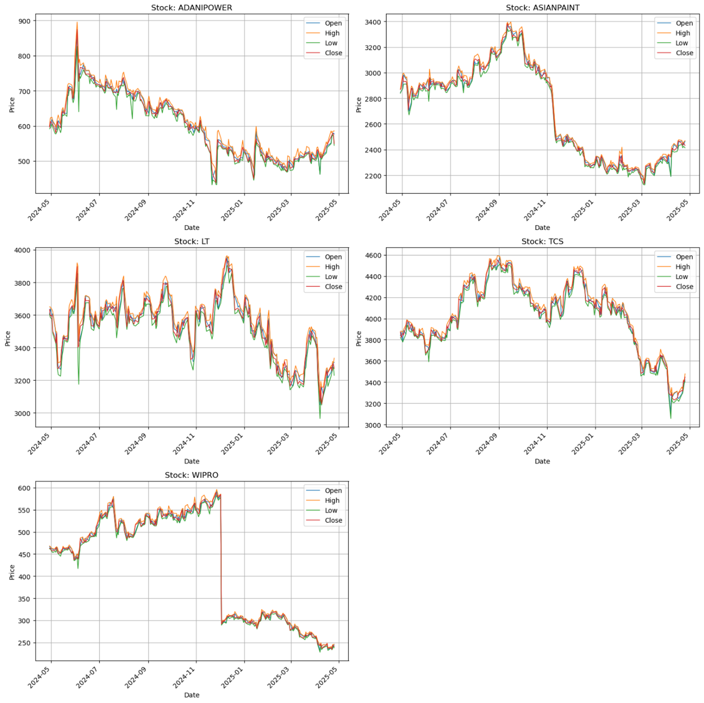
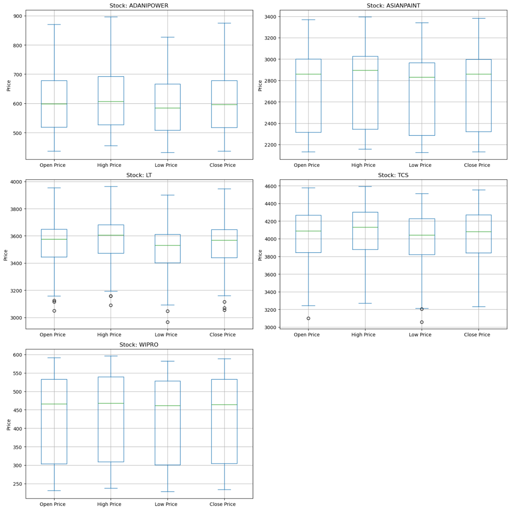
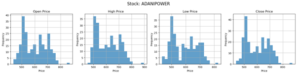
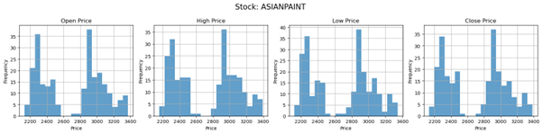
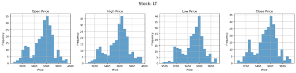
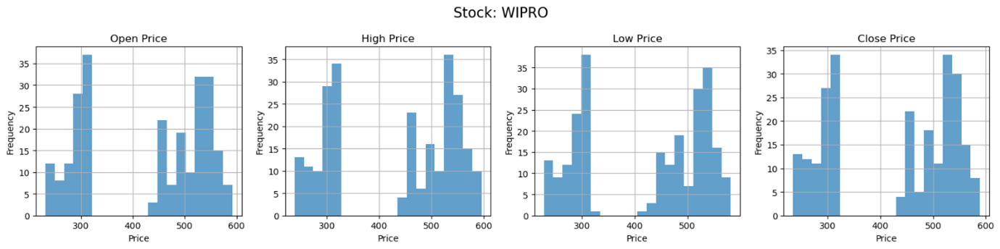
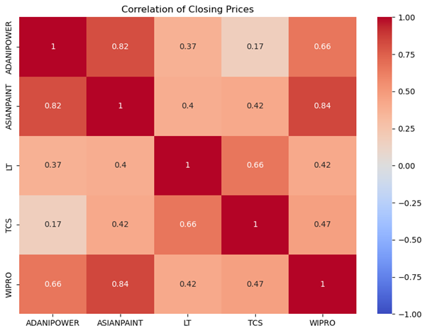

# Stock Price & NIFTY Index Predictive Analytics (DS203)

This project analyzes the relationship between major NSE-listed stocks and the NIFTY-50 index using 
proper Data Science methodology. The objective is to:
- understand inter-stock relationships,
- build lag-based predictive models,
- analyze multicollinearity,
- and evaluate the trade-off between predictive accuracy and residual quality.

The project strictly follows best practices including data cleaning, synchronization, EDA, 
multi-model comparison, residual diagnostics, and interpretation.

---

## 📌 Dataset

Daily OHLC data for the following were used:
- ADANIPOWER
- ASIANPAINT
- LT
- TCS
- WIPRO
- NIFTY-50 Index

All files contain ~247 trading days of data.  
Data was carefully synchronized on Date and duplicates were removed before analysis.

---

## 🔍 Data Validation & Preprocessing

Initial checks were performed for:
- missing values  
- duplicate rows  
- column consistency across files  
- row count mismatches  

Duplicates were found in multiple files and dropped.  
Dates not present across all stocks were removed to ensure proper alignment before correlation and regression.

---

## 📊 Exploratory Data Analysis (EDA)

To understand price behaviour and volatility patterns, the following plots were created:

### 1. Price Trend Plots (OHLC)
These plots reveal that:
- **LT and TCS** show similar long-term movement patterns.
- **ASIANPAINT and WIPRO** show similar sudden price drops and recovery behaviour.
- **ADANIPOWER** behaves distinctly compared to others.

---

### 2. Box Plots (Outlier Detection)
Outliers observed in LT and TCS are due to structural price decline rather than true anomalies.  
No points were removed as these reflect real market behaviour.

---

### 3. Histograms (Price Distribution)
ASIANPAINT and WIPRO exhibit **bunching of prices** into two regions (pre-drop and post-drop), 
indicating regime change rather than noise.

---

## 🔗 Correlation Analysis

A correlation heatmap was generated to identify the strongest inter-stock relationships.

Key observations:
- **LT and TCS** show high positive correlation.
- **ASIANPAINT and WIPRO** also show strong correlation.
- **ADANIPOWER** has low correlation with all others.

These correlations guided the choice of stock pairs for regression tasks.

---

## 📈 R1: Predict ASIANPAINT using Previous Day WIPRO Close

Lag-based features were created using `shift(1)`.  
Multiple models were trained after an 80:20 train-test split with shuffling:
- Linear Regression
- KNN
- Random Forest
- Gradient Boosting

Evaluation metrics used:
- R²
- RMSE
- MAE
- JB statistic
- DW statistic

Based on metrics and residual diagnostics, **KNN** was found most suitable.

---

## 📈 R2: Predict ASIANPAINT using Previous Day WIPRO OHLC

The feature set was extended to include previous day:
- Open
- High
- Low
- Close

Observations:
- Random Forest performance improved significantly due to richer feature space.
- However, residual diagnostics indicated increased overfitting.

---

## 📈 R3: Predict NIFTY using Previous Day OHLC of All Stocks

NIFTY was predicted using lagged OHLC values of:
- ADANIPOWER
- ASIANPAINT
- LT
- TCS
- WIPRO

Total features = 20.

Tree-based methods (Random Forest, Gradient Boosting) showed best performance:
- High R²
- Low RMSE & MAE
- JB p-values indicating normal residuals
- DW ≈ 2 indicating low autocorrelation

---

## 📉 Multicollinearity Analysis (VIF)

Variance Inflation Factor (VIF) was computed for all features.

Result:
- Extremely high multicollinearity was observed among several OHLC features.
- A VIF threshold of 30 was used to flag features.

---

## 📈 R4: Predict NIFTY after VIF-based Feature Reduction

Features flagged by VIF were dropped and models retrained.

Observations:
- R², RMSE, MAE deteriorated due to reduced feature space.
- However, residual quality improved:
  - JB statistics reduced
  - DW closer to 2
  - Indicating reduced overfitting and better statistical behaviour

---

## 🧠 Final Interpretation

Key trade-offs observed:
- **R1 → R2:** Accuracy improved but residual quality worsened (overfitting risk).
- **R3 → R4:** Accuracy worsened but residual quality improved (better statistical validity).

This highlights the need for:
- regularization,
- feature engineering,
- and careful balance between predictive power and model stability.

---

## 🛠️ Tech Stack

- Python
- Pandas, NumPy
- Matplotlib, Seaborn
- Scikit-learn
- Statsmodels

---

## 📌 Author

**Jaywardhan Raghu**  
B.Tech, IIT Bombay  
Data Science & Analytics

---
